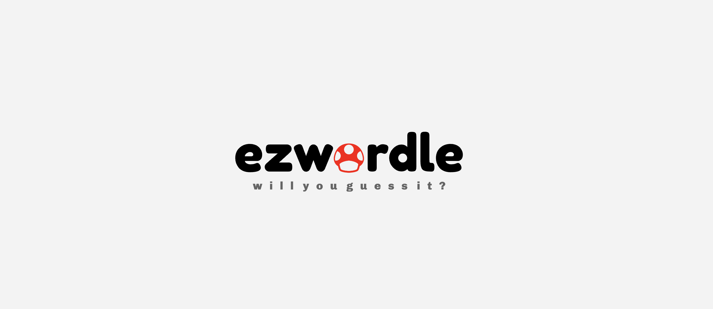

# Rails Worlde API
Hi! Im the API of your favorite game, **Wordle**. If you want to know more about me you can keep reading.

If you would like to play with me, **download me**...

 - [ functionalities](#functionalities)
	2. [Users](#users)
	3. [Matches](#matches)
	4. [Words](#words)
 - [Technologies](#technologies)

# 1. Functionalities

## 1.1 Users
 - User register
 - User login with JWT token authorization and autentication.
 - Password change
 - Email change
 - Leaderboard
 - User stats

## 1.2 Matches

 - Only one match per user a day is allowed.
 - Each attempt is validated by a color algorithm which compares correct answer and attempt's answer.
 - 5 max attempts per match.
 - Basic mode
	 -  Scientific, custom and speed modes (en desarrollo)

## 1.3 Words
 - *on-demand* random word generation.
 - Basic mode
	 -  Scientific, custom and speed modes (en desarrollo)

# 2. Technologies

    Ruby 3.0
    Rails 7.0
    PostgreSQL 14.5

**JWT token autenticaction and authorization**

**Advantages:**
 - JWT tokens are stateless: server does not need to mantain sessions
 - Self-sufficient in identifying users and saves session/user lookups
 - Not relying on cookies means JWT tokens are immune to CSRF attacks
 - Works well with mobile apps as there is no need to maintain cookies.

**Authenticate User Service**

 - Pass email, password to the authenticate user service from auth-controller
 - Validate email, password using authenticate method on the User model
 - If User model authentication succeeds return JWT token in response

 **Authorize API request Service**

 - Pass authorization HTTP header from request to authorization service
 - Decode the JWT token from the header and validate the user ID stored in it
 - If valid user ID found in the decoded JWT token return user model
